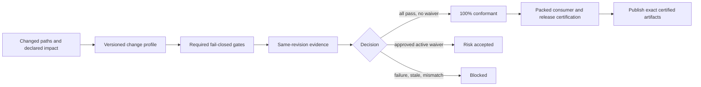

# Implementation Plan: Engineering Quality Hardening

**Branch**: `006-engineering-quality-hardening` | **Date**: 2026-08-08 | **Spec**: [spec.md](./spec.md)
**Input**: Complete engineering-quality recovery plan covering governance, code, React, componentization, architecture, testing, accessibility, security, performance, artifacts, and releases.
**Authorization**: `APPROVED_FOR_IMPLEMENTATION` for T101-T176 is recorded in `approval.md`; final certification and publication remain separately gated.

## Summary

Create a versioned engineering-quality control plane around the existing Taliya Product UI library, then reduce structural debt incrementally without breaking its public API or visual contract. The control plane combines portable repository instructions, machine-readable change profiles, fail-closed deterministic gates, evidence provenance, fingerprinted architecture/performance ratchets, expiring waivers, packed-consumer verification, and same-revision release certification.

Implementation is divided into independently reversible waves: reconcile the source of truth; make CI and artifacts deterministic; establish behavior/browser/accessibility/visual evidence; freeze the public API; modularize UI and CRM behind stable barrels; harden supply chain and performance; certify the exact artifacts. Structural and behavior changes do not share a slice.

## Technical Context

**Language/Version**: TypeScript `^5.9.3`, JavaScript ES modules, React `^19.2.1`
**Runtime/Package Manager**: Node `^20.19.0 || >=22.12.0`, pnpm `9.15.4`
**Primary Dependencies**: React 19, Radix wrappers, Lucide; Vite `^7.2.4`; Storybook `^10.4.1`
**Storage**: Versioned Markdown, one canonical JSON policy, reports, screenshots, and package artifacts; no runtime database
**Testing**: Vitest `^4.0.14`, Testing Library, Storybook browser/Vitest integration, Playwright release/PR projects, axe, deterministic visual comparison, packed-consumer fixtures
**Target Platform**: Published ESM browser packages; development and certification on Windows, macOS, and Linux; Chromium on PR, Chromium/Firefox/WebKit on release
**Project Type**: Monorepo component library with `@taliya/tokens`, `@taliya/ui`, `@taliya/crm`, and a Storybook docs application
**Performance Goals**: No package/CSS/tarball/tree-shaking regression beyond calibrated budgets; no representative render/update regression beyond a reproducible ratchet; no unmeasured performance claim
**Constraints**: Preserve `tokens -> ui -> crm -> docs`; no backend or product logic; preserve root exports and CSS entry points; check mode is read-only; evidence and published artifacts belong to one revision; no implementation before SDD approval
**Scale/Scope**: Hundreds of public declarations and stories, three published packages, large monolithic UI/CRM source and CSS, more than one hundred existing audit scripts, and multiple historical Spec Kit features

## Constitution Check

*Gate evaluated before research and re-evaluated after design. The plan introduces no authorized constitutional exception.*

| Principle | Plan evidence | Result |
|---|---|---|
| I. Product UI Only | No landing, SEO, marketing, backend, or product runtime work is planned. | PASS |
| II. Library-First And Consumer-Agnostic | Packed-consumer contracts validate prepared data/callback APIs. | PASS |
| III. Token-Driven Visual System | Token audits remain mandatory; modularization cannot introduce visual literals. | PASS |
| IV. Accessibility And States Are Required | Browser, axe, keyboard, focus, states, and reduced-motion gates are planned. | PASS |
| V. Storybook Is The Visual Contract | Isolated stories, browser execution, static capture, and human 1:1 review are release evidence. | PASS |
| VI. Clear Package Boundaries | Existing package DAG remains invariant; AST and dependency-cycle checks enforce it. | PASS |
| VII. No Real Product Logic | Consumer security responsibilities and presentation-only contracts are explicit. | PASS |
| VIII. Specification And Bidirectional Traceability | Spec, research, contracts, tasks, matrices, and approval gate form the SDD package. | PASS |
| IX. Sustainable Architecture And React Quality | Exact baselines, touched-code ratchets, semantic API inventory, and incremental splits are planned. | PASS |
| X. Executable, Risk-Based Verification | Change profiles select fail-closed checks with negative probes and same-revision evidence. | PASS |
| XI. Secure And Deterministic Delivery | Runtime/toolchain audits, immutable actions, least privilege, OIDC, provenance, and clean consumers are planned. | PASS |
| XII. Measured Performance And Certified Releases | Reproducible baselines precede budgets; final certification rejects waivers and stale evidence. | PASS |

Historical gaps such as non-blocking accessibility, missing maintained E2E, stale artifacts, vulnerable toolchain dependencies, monolithic modules, and absent runtime performance baselines are addressed by the implementation waves. Final certification still requires fresh evidence for the exact clean revision.

## Project Structure

### Documentation for this feature

```text
specs/006-engineering-quality-hardening/
|-- spec.md
|-- research.md
|-- data-model.md
|-- plan.md
|-- tasks.md
|-- quickstart.md
|-- current-state-audit.md
|-- source-of-truth-reconciliation.md
|-- architecture-migration.md
|-- test-strategy.md
|-- security-strategy.md
|-- performance-strategy.md
|-- ci-gate-matrix.md
|-- definition-of-done.md
|-- traceability-matrix.md
|-- risk-register.md
|-- approval.md
|-- contracts/
|   |-- sdd-lifecycle-contract.md
|   |-- quality-policy.schema.json
|   |-- gate-run.schema.json
|   |-- evidence-provenance.schema.json
|   |-- waiver.schema.json
|   |-- release-certification.schema.json
|   |-- public-api-compatibility-contract.md
|   `-- architecture-ratchet-contract.md
`-- checklists/
    |-- requirements.md
    |-- sdd-readiness.md
    `-- implementation-readiness.md
```

### Existing source layout preserved at entry

```text
packages/
|-- tokens/src/
|-- ui/src/
`-- crm/src/

apps/docs/
|-- .storybook/
`-- src/stories/

scripts/
.github/workflows/
```

### Target implementation layout

```text
governance/
|-- quality-policy.json
|-- baselines/
|-- waivers/
`-- README.md

scripts/
|-- quality/
|   `-- probes/
`-- performance/

tests/
|-- e2e/
|-- fixtures/
|   |-- package-consumer/
|   `-- tree-shaking-consumer/
`-- performance/

packages/ui/src/
|-- components/<family>/
|-- hooks/
|-- internal/
`-- index.ts

packages/crm/src/
|-- shared/
|-- registry/
|-- shell/
|-- worklists/
|-- drawers/
|-- domains/<domain>/
`-- index.ts
```

**Structure decision**: keep the current workspaces and public package boundaries. Add governance and test infrastructure at the root. Split internals by reusable UI family and CRM domain behind thin barrels. Do not create a new package until a later evidence-based ADR shows a genuine independent ownership/versioning boundary.

## Design

### Control flow



### Canonical change profiles

The only valid machine-readable profile IDs are the following exact values. They are defined once in `governance/quality-policy.json`, which validates against `contracts/quality-policy.schema.json`; prose, scripts, workflows, and fixtures consume that file and do not maintain parallel YAML or per-domain catalogs.

| Profile | Typical scope | Mandatory gate set |
|---|---|---|
| `sdd-only` | `specs/006/**`, `.specify/**`, and planning-only instruction edits | `GATE-SDD-APPROVED` |
| `governance` | `AGENTS.md`, repository skills/rules, `governance/**`, policy and gate scripts | `G-GOV`, `G-LINT`, `G-UNIT`, `G-PROVENANCE` |
| `documentation-only` | prose with no story, build, package, contract, or executable impact | `G-GOV`, `G-PROVENANCE` |
| `tokens` | `packages/tokens/**`, token contracts, and token baselines | `G-GOV`, `G-TYPE`, `G-LINT`, `G-UNIT`, `G-COV`, `G-ARCH`, `G-TOKENS`, `G-STORY-BUILD`, `G-STORY-TEST`, `G-A11Y`, `G-VISUAL`, `G-PERF`, `G-PACK`, `G-CONSUMER`, `G-PROVENANCE` |
| `ui-component` | `packages/ui/**` public behavior, source, or style | `G-GOV`, `G-TYPE`, `G-LINT`, `G-UNIT`, `G-COV`, `G-ARCH`, `G-TOKENS`, `G-STORY-BUILD`, `G-STORY-TEST`, `G-A11Y`, `G-E2E-PR`, `G-E2E-RELEASE`, `G-VISUAL`, `G-SEC-SAST`, `G-PERF`, `G-PACK`, `G-CONSUMER`, `G-PROVENANCE` |
| `crm-component` | `packages/crm/**` compositions, domains, behavior, or style | `G-GOV`, `G-TYPE`, `G-LINT`, `G-UNIT`, `G-COV`, `G-ARCH`, `G-TOKENS`, `G-STORY-BUILD`, `G-STORY-TEST`, `G-A11Y`, `G-E2E-PR`, `G-E2E-RELEASE`, `G-VISUAL`, `G-SEC-SAST`, `G-PERF`, `G-PACK`, `G-CONSUMER`, `G-PROVENANCE` |
| `storybook-docs` | `apps/docs/src/**` and Storybook configuration | `G-GOV`, `G-TYPE`, `G-LINT`, `G-UNIT`, `G-STORY-BUILD`, `G-STORY-TEST`, `G-A11Y`, `G-E2E-PR`, `G-E2E-RELEASE`, `G-VISUAL`, `G-PROVENANCE` |
| `dependency-build` | lockfile, package metadata, compiler, test, or build configuration | `G-GOV`, `G-TYPE`, `G-LINT`, `G-UNIT`, `G-ARCH`, `G-SEC-RUNTIME`, `G-SEC-TOOLCHAIN`, `G-SEC-SAST`, `G-SEC-SECRETS`, `G-PERF`, `G-PACK`, `G-CONSUMER`, `G-PROVENANCE` |
| `workflow-release` | `.github/workflows/**`, changesets, publish/release scripts, versions, or release artifacts | `G-GOV`, `G-LINT`, `G-UNIT`, `G-SEC-RUNTIME`, `G-SEC-TOOLCHAIN`, `G-SEC-SAST`, `G-SEC-SECRETS`, `G-PERF`, `G-PACK`, `G-CONSUMER`, `G-PROVENANCE`, `G-RELEASE` |
| `full` | unknown, ambiguous, cross-cutting, package-boundary, or release-candidate scope | `G-GOV`, `G-TYPE`, `G-LINT`, `G-UNIT`, `G-COV`, `G-ARCH`, `G-TOKENS`, `G-STORY-BUILD`, `G-STORY-TEST`, `G-A11Y`, `G-E2E-PR`, `G-E2E-RELEASE`, `G-VISUAL`, `G-SEC-RUNTIME`, `G-SEC-TOOLCHAIN`, `G-SEC-SAST`, `G-SEC-SECRETS`, `G-PERF`, `G-PACK`, `G-CONSUMER`, `G-PROVENANCE`, `G-RELEASE` |

Profiles combine by union. `GATE-SDD-APPROVED` is the global implementation precondition even when it is not repeated in an implementation profile. A gate may be `not-applicable` only with a policy-defined reason emitted into the gate run.

### Evidence and status

Canonical machine-readable statuses are `pass`, `fail`, `blocked`, `error`, and `not-applicable` for individual gates; `100%-conformant`, `risk-accepted`, and `not-certified` for a change; `certified`, `risk-accepted`, and `rejected` for release candidates. A UI may render `risk-accepted` as the human label "accepted risk", but stored policy/evidence never changes the machine value. `100%-conformant` and `certified` require fresh evidence for one revision and zero active waiver in scope.

## Delivery Waves

### Wave 0 - SDD approval

Complete this documentation package, validate schemas/placeholders/traceability, record `AWAITING_USER_APPROVAL`, and stop. This gate was completed and the user approved T101-T176; subsequent waves execute only within their declared dependencies. Publication remains separately guarded.

**Exit**: SDD checks pass and the user explicitly changed the decision to `APPROVED`.

### Wave 1 / P1 - Source of truth and portable governance

Reconcile features 001-005, repair repository Spec Kit skills, shorten root instructions, add nested ownership instructions, separate command rules, and create the sole machine-readable rule/change-profile registry at `governance/quality-policy.json`. Implement complete waiver schema and semantic validation in this phase so every later gate can fail closed on invalid scope, ownership, approval, prohibited risk, or expiry.

**Exit**: clean clone discovers every required instruction/skill; contradiction, missing rule metadata, invalid waiver, and unknown profile probes fail.

### Wave 2 / P2 - Deterministic fail-closed foundation

Normalize line endings, replace the eight CRLF-sensitive assertions in `packages/crm/src/index.test.tsx` with semantic CSS/layout assertions, eliminate stale `dist` resolution ambiguity, create the canonical gate runner, propagate child exit codes, distinguish check/update modes, fingerprint reports, and make the current CI required.

**Exit**: two same-input checks have the same normalized result without tracked mutations; every negative probe fails locally and in CI; Windows/macOS/Linux matrix passes.

### Wave 3 / P3 - Behavioral, browser, accessibility, and E2E evidence

Add coverage policy, execute stories and interactions in browser mode, add axe/keyboard/focus/reduced-motion enforcement, create Playwright packed-consumer journeys, and re-certify responsive/visual inventory.

**Exit**: thresholds and critical behavior requirements pass; no unauthorized skip/quarantine; zero unwaived serious/critical axe issue; current inventory has no unapproved runtime/overflow/visual failure.

### Wave 4 / P4 - Public API freeze and architecture enforcement

Inventory every public export and signature, add semantic compatibility checks, replace snippet/name audits with AST rules, fingerprint current findings, and enforce cycles/ownership/size/complexity ratchets.

**Exit**: public snapshot is complete; new/touched code passes final budgets; historical findings cannot grow, move, or reappear.

### Wave 5 / P5 - Incremental UI modularization

Extract UI families and CSS domains one structural slice at a time. Preserve root barrels, declaration inventory, CSS public path, runtime behavior, accessibility, and visual output.

**Exit**: UI handwritten monolith debt is eliminated, with equivalent packed-consumer and visual evidence after every slice.

### Wave 6 / P6 - Incremental CRM modularization

Extract CRM shared infrastructure, shells, worklists/drawers, then independent product domains. Keep page-family registries and compatibility aliases stable. Parallelize only domains with disjoint files after shared seams land.

**Exit**: CRM handwritten monolith debt is eliminated, package direction remains valid, and every consumer contract remains compatible.

### Wave 7 / P7 - Security and supply-chain certification

Remediate release-path vulnerabilities, add static/dependency/secret checks, pin actions, minimize permissions, use protected OIDC publication, generate SBOM/provenance, and validate unsafe browser sinks plus consumer obligations.

**Exit**: zero critical/high release-path finding, immutable automation, no long-lived publish token, and explicit library/consumer responsibility matrix.

### Wave 8 / P8 - Performance baselines and budgets

Measure package/CSS/tarball contents, tree shaking, and representative render/update fixtures. Stabilize noise, approve baselines, add ratchets, and optimize only measured bottlenecks.

**Exit**: every release metric has reproducible provenance and passes an approved budget; no performance claim lacks comparable evidence.

### Wave 9 / P9 - Release certification

From one clean revision, execute supported OS/browser matrices, pack once, install those tarballs into the consumer, generate hashes/SBOM/provenance, verify zero waiver/stale evidence, and publish the same immutable files.

**Exit**: human-approved `CERTIFIED` record identifies the exact artifacts. Rebuilding after certification is prohibited.

## PR and Dependency Strategy

1. Land governance schemas and negative probes before turning a check blocking.
2. Make deterministic graph/report fixes before introducing coverage, browser, or performance baselines.
3. Freeze the full API before the first module move.
4. Separate structural slices from behavior/style changes; each slice is independently revertible.
5. Land shared CRM seams before parallel domain extraction.
6. Establish performance baselines after deterministic build/browser infrastructure but before optimization.
7. Harden publication only after all prerequisite gate evidence can be consumed in the same job.

No task may update a baseline in the same unreviewed step that introduces the finding. A failing new gate is fixed or explicitly transitioned through a scoped waiver; it is never weakened to obtain green CI.

## Rollback

- Governance/gate changes retain the prior command as a diagnostic-only fallback for one wave, never as a success override.
- Modularization PRs preserve public barrels, so reverting a slice restores internals without a consumer migration.
- A schema version change is additive during a transition; readers reject unknown required fields rather than silently ignoring them.
- A release candidate is rejected when provenance breaks. Published versions are not overwritten; remediation uses a new version.

## Complexity Tracking

No constitutional violation is approved. Historical monoliths, broad public surfaces, stale evidence, and missing gates are recorded as exact implementation debt. They may be baselined temporarily only under the architecture ratchet; final certification requires eliminating handwritten-code baseline debt.

## Plan Exit Criteria

- Research resolves every material unknown or assigns a baseline task.
- Data entities and contracts cover policy, gates, evidence, API, debt, waivers, and releases.
- Every wave has prerequisites, blocking evidence, rollback, and a measurable exit.
- Every functional requirement maps to at least one blocked implementation task and evidence mechanism.
- No plan step changes product code before explicit approval.
